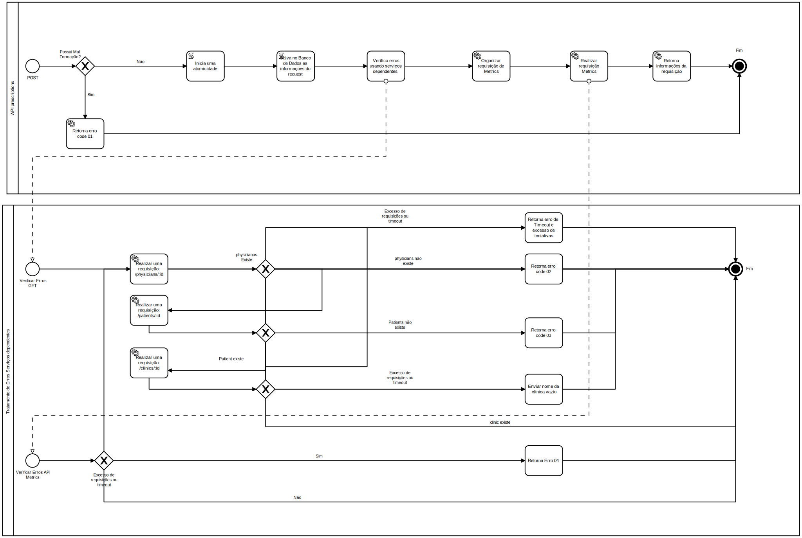

# Prescrição Médica

A missão da iClinic é descomplicar a saúde no Brasil levando mais gestão a clínicas e consultórios através da tecnologia e, com isso, possibilitar que médicos e outros profissionais promovam mais saúde aos seus pacientes.

### Pré Requisitos
+ [python](https://www.python.org/)
+ [Django](https://www.djangoproject.com/)
+ [Django rest](https://www.django-rest-framework.org/)
+ [requests](https://docs.python-requests.org/en/master/)
+ [gunicorn](https://docs.gunicorn.org/en/stable/run.html)
+ [psycopg2-binary](https://pypi.org/project/psycopg2-binary/)
+ [httmock](https://pypi.org/project/httmock/)
+ [drf-yasg](https://drf-yasg.readthedocs.io/en/stable/)

 ## Váriaveis de Ambiente

`POSTGRES_USER`

`POSTGRES_PASSWORD`

`POSTGRES_HOST`

`POSTGRES_PORT`

`POSTGRES_DB`

`CLINICS_BEARER`

`PHYSICIANS_BEARER`

`PATIENTS_BEARER`

`METRICS_BEARER`

`CLINICS_HOST`

`PHYSICIANS_HOST`

`PATIENTS_HOST`

`METRICS_HOST`

`DEBUG`


## Instalação

```bash 
    docker-compose build
    docker-compose up
```
### **Para acessar digite no navegador http://localhost:5000**
## Rotas

|Verb  |URI Pattern              
:----:|-------------------------|
| POST  | /prescriptions

### **Você pode acessar /swagger para verificar a documentação**

## Uso/Exemplo

Realize um Post para o endpoint /prescriptions 
```bash
curl -X POST \
  http://localhost:5000/prescriptions \
  -H 'Content-Type: application/json' \
  -d '{
  "clinic": {
    "id": 1
  },
  "physician": {
    "id": 1
  },
  "patient": {
    "id": 1
  },
  "text": "Dipirona 1x ao dia"
}'
```

## BPMN



  
## Executar os Testes

Para executar os testes com o projeto em docker

```bash
  docker-compose run prescription python manage.py test
```
## **Porém no entrypoint da aplicação os testes já estão sendo executados**

  
## Relacionado


[Página do Desafio](https://github.com/iclinic/iclinic-python-challenge)

  